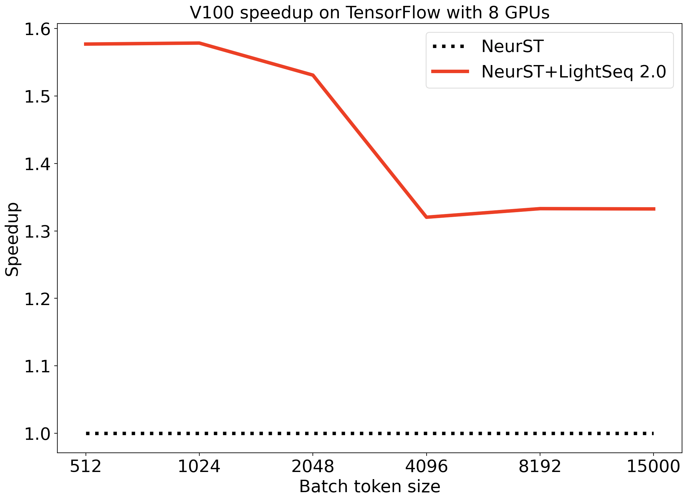
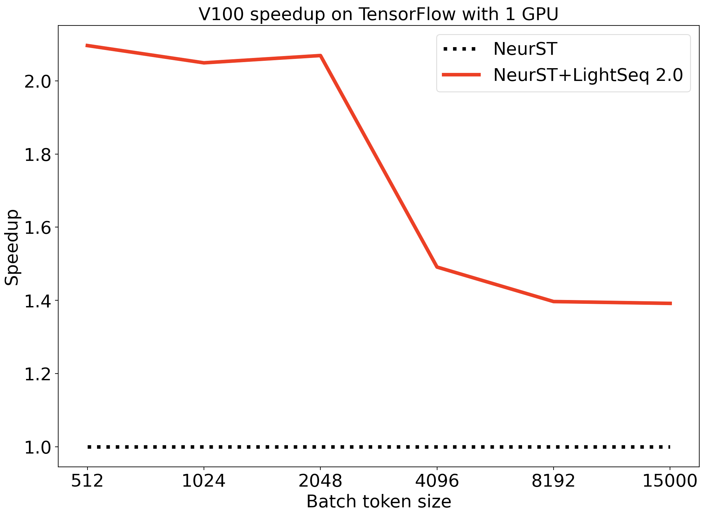

# NeurST: Neural Speech Translation Toolkit
NeurST aims at easily building and training end-to-end speech translation, which has the careful design for extensibility and scalability. We believe this design can make it easier for NLP researchers to get started. In addition, NeurST allows researchers to train custom models for translation, summarization and so on.

> NeurST is based on TensorFlow2 and we are working on the pytorch version.

## Features

### Fast training
NeurST uses [LightSeq 2.0](https://code.byted.org/lab/lightseq2) for fast training.
LightSeq 2.0 is an efficient training acceleration library for Transformers implemented in CUDA.
It enables highly efficient computation of modern NLP models such as BERT, Transformer, etc. Currently, only fused encoder and decoder layers have been integrated, further acceleration models such as loss layer and optimizer is coming.
In the standard machine translation task, NeurST has a single GPU and eight GPU acceleration ratio of 1.52 and 1.33 respectively with batch size 4096, compared with Tensorflow implementation of Transformers. In the case of batch size 512, the acceleration ratio is 2.09 and 1.56.

Comparison of training speed with different batch sizes are shown below.
- 8 GPUs


- 1 GPU


### Models
NeurST provides reference implementations of various models, including:

- Transformer (self-attention) networks
    - [Attention Is All You Need (Vaswani et al., 2017)](https://arxiv.org/pdf/1706.03762.pdf)
    - [Pay Less Attention With Lightweight and Dynamic Convolutions (Wu et al., 2019)](https://arxiv.org/pdf/1901.10430.pdf)
    - CTNMT (Transformer with BERT enhanced encoder) from [Towards making the most of bert in neural machine translation (Yang et al., 2020)](https://arxiv.org/abs/1908.05672), see the examples in [CTNMT](/examples/ctnmt/README.md)
    - Prune-Tune: [Finding Sparse Structures for Domain Specific NMT](https://arxiv.org/abs/2012.10586)

### Recipes and Benchmarks
NeurST provides several **strong and reproducible benchmarks** for various tasks:

- Text Translation
    - [Transformer models on WMT14 en->de](/examples/translation)
- Speech-to-Text Translation
    - [Augmented Librispeech](/examples/speech_to_text/augmented_librispeech)
    - [MuST-C](/examples/speech_to_text/must-c)
- [Weight Pruning](/examples/weight_pruning/README.md)
- [Quantization Aware Training](/examples/quantization/README.md) 


### Additionally

- multi-GPU (distributed) training on one machine or across multiple machines
    - `MirroredStrategy` / `MultiWorkerMirroredStrategy`
    - [`Byteps`](https://github.com/bytedance/byteps) / [`Horovod`](https://github.com/horovod/horovod)
- mixed precision training (trains faster with less GPU memory)
- multiple search algorithms implemented:
    - beam search
    - sampling (unconstrained, top-k and top-p)
- large mini-batch training even on a single GPU via delayed updates (gradient accumulation)
- TensorFlow savedmodel for TensorFlow-serving
- TensorFlow XLA support for speeding up training
- extensible: easily register new datasets, models, criterions, tasks, optimizers and learning rate schedulers

## Requirements and Installation

- Python version >= 3.6
- TensorFlow >= 2.3.0

Install NeurST from source:
```
git clone https://github.com/bytedance/neurst.git
cd neurst/
pip3 install -e .
```
If there exists ImportError during running, manually install the required packages at that time.

To enable LightSeq for fast training, you need to choose the right python package locally based on your environment.
For example, if your platform is Linux with python 3.7, cuda 11 and tensorflow 2.4, you can install LightSeq using command:

```
pip3 install http://sf3-ttcdn-tos.pstatp.com/obj/nlp-opensource/lightseq/tensorflow/lightseq_tf-2.0.1-cp37-cp37m-linux_x86_64.whl
```

## Citation
```
@misc{zhao2020neurst,
      title={NeurST: Neural Speech Translation Toolkit}, 
      author={Chengqi Zhao and Mingxuan Wang and Lei Li},
      year={2020},
      eprint={2012.10018},
      archivePrefix={arXiv},
}
```

## Contact
Any questions or suggestions, please feel free to contact us: [zhaochengqi.d@bytedance.com](mailto:zhaochengqi.d@bytedance.com), [wangmingxuan.89@bytedance.com](mailto:wangmingxuan.89@bytedance.com).

## Acknowledgement
We thank Bairen Yi, Zherui Liu, Yulu Jia, Yibo Zhu, Jiaze Chen, Jiangtao Feng, Zewei Sun for their kind help. 
